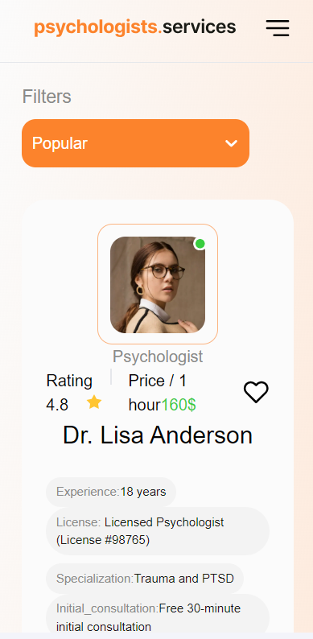
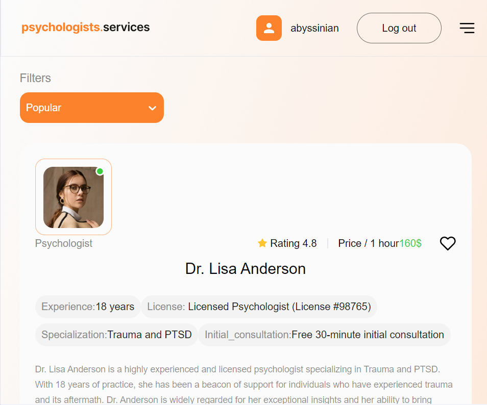
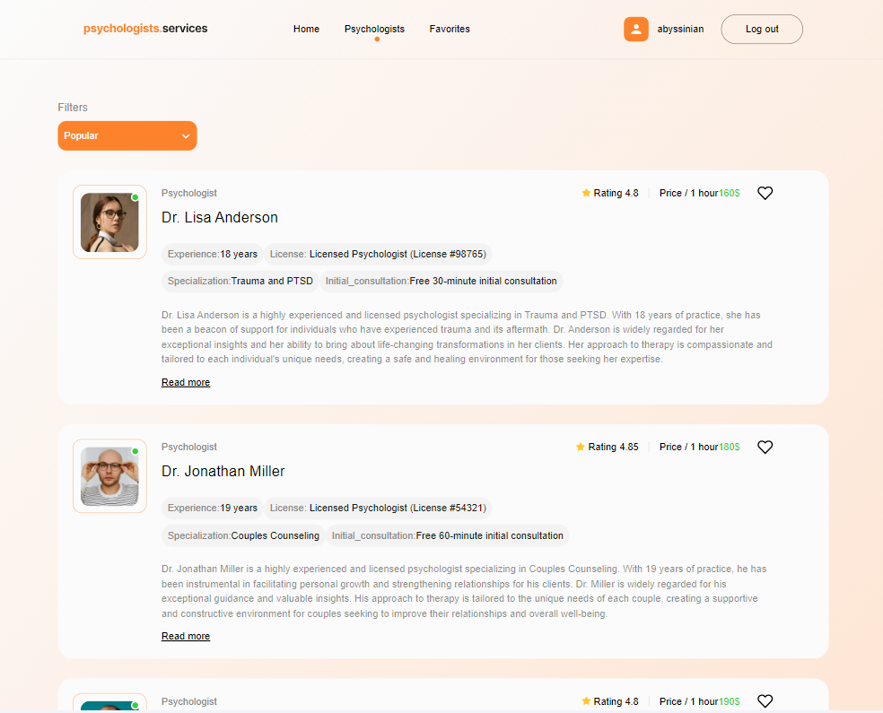

# About project

An application for a company offering the services of psychologists. The application consists of 3 pages:

The "Home" page with the website title, the company slogan, and a link that encourages starting work with the application and redirects to the "Psychologists" page.
The "Psychologists" page containing a list of psychologists that users can sort alphabetically in ascending order (from A to Z) or descending order (from Z to A), by price (from lowest to highest or vice versa), and by popularity (from lowest to highest rating or vice versa).
The private "Favorites" page with psychologists added by the user to their favorites.

# Dependencies

"@hookform/resolvers": "^3.4.0",
"@reduxjs/toolkit": "^2.2.4",
"axios": "^1.6.8",
"clsx": "^2.1.1",
"firebase": "^10.12.0",
"react": "^18.2.0",
"react-dom": "^18.2.0",
"react-hook-form": "^7.51.4",
"react-loader-spinner": "^6.1.6",
"react-redux": "^9.1.2",
"react-router-dom": "^6.23.0",
"react-select": "^5.8.0",
"react-toastify": "^10.0.5",
"redux-persist": "^6.0.0",
"yup": "^1.4.0"

# Adaptation

